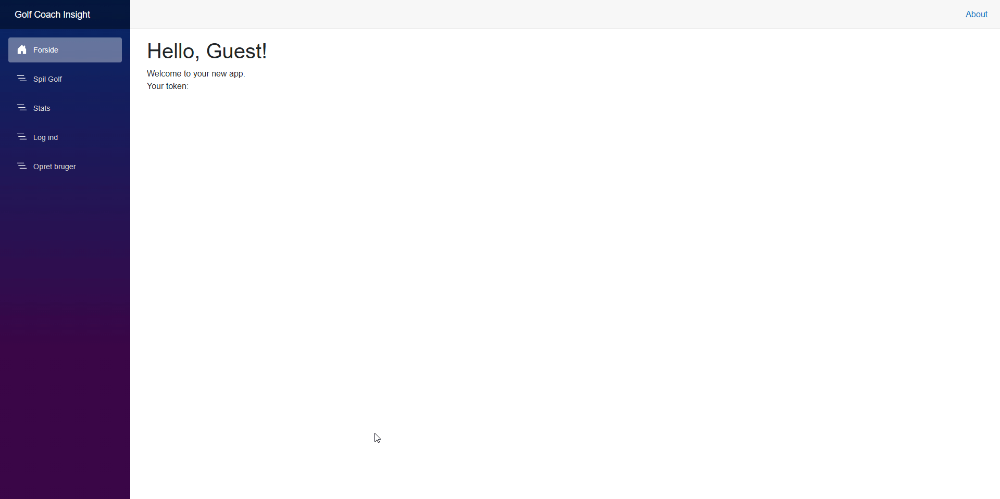
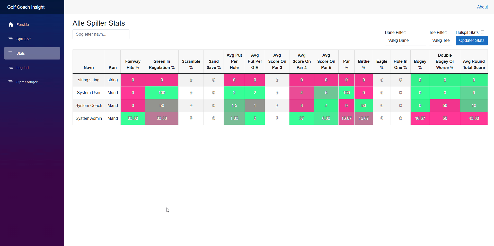

### **Logbog**

---

### **13. august – 10. oktober: Projektopstart og backend-design**

#### **Indledning**
I denne fase designede jeg backend-strukturen til projektet for Odense Golfklub. Fokus var at skabe en robust og skalerbar løsning, der understøtter datamodellering og effektiv API-kommunikation. Arbejdet inkluderede kravindsamling, planlægning og implementering af nøglefunktioner i backend med vægt på modularitet og sikkerhed.

#### **Læringsmål og fokusområder**
- Implementere principperne bag Clean Architecture for at sikre klar ansvarsfordeling mellem applikationens lag.
- Design og implementering af datamodeller til repræsentation af golfbaner, loops og relaterede data.
- Udvikling af API’er, der understøtter sikker kommunikation mellem backend og frontend via JWT-tokens.

#### **Tekniske Implementeringer**
- **Systemarkitektur:**
  - Backend-strukturen blev opdelt i klart definerede lag:
    - **Domain:** Indeholder kerneentiteter og deres relationer.
    - **Application:** Håndterer use cases og validering.
    - **Infrastructure:** Sikrer dataadgang via repositories.
    - **API:** Eksponerer funktionalitet til frontend.

**Struktur af Clean Architecture**:
```plaintext
GolfCoachInsight
│
├── Domain
│   └── Entities
│
├── Application
│   ├── Features
│   ├── Validators
│   ├── Contracts
│   └── Services
│
├── Infrastructure
│   ├── Persistence
│   │   └── Repositories
│
└── API
    └── Controllers
```

- **Validering og sikkerhed:** Backend sikrer dataintegritet med FluentValidation og beskytter endpoints med JWT-tokens.

#### **FluentValidation**
For at validere data, har hver DTO en tilsvarende `DtoValidator`, hvor jeg ved brug af FluentValidation kan definere brugerdefinerede regler. Eksempelvis validerer følgende klasse, om en golfklubs navn er unikt:
```csharp
public class CreateGolfClubDtoValidator : AbstractValidator<CreateGolfClubDto>
{
    private readonly IGolfClubRepository _golfClubRepository;

    public CreateGolfClubDtoValidator(IGolfClubRepository golfClubRepository)
    {
        _golfClubRepository = golfClubRepository;

        RuleFor(p => p.Name)
            .NotEmpty().WithMessage("{PropertyName} is required.")
            .NotNull().WithMessage("{PropertyName} is required and must not be null.")
            .MustAsync(async (name, token) =>
            {
                var golfClubExsist = await _golfClubRepository.IsNameAvailable(name);
                return golfClubExsist; // Return true, if the name does not exist.
            })
            .WithMessage("A golf club with the provided {PropertyName} already exists.");
    }
}
```
Denne validering sikrer korrekt input og forhindrer duplikationer ved at tjekke, om golfklubbens navn allerede findes i databasen.

#### **JWT-tokenhåndtering**
Backend bruger JWT-tokens til at beskytte API-endpoints og sikre, at kun autoriserede brugere kan få adgang til bestemte ressourcer. For at sikre autentifikationen i API’et, er der konfigureret JWT-validering i `Program.cs`:
```csharp
services.AddSwaggerGen(c =>
{
    c.AddSecurityDefinition("Bearer", new OpenApiSecurityScheme
    {
        Description = @"JWT Authorization header using the Bearer scheme. 
                        Enter 'Bearer' [space] and then your token in the text input below.
                        Example: 'Bearer 12345abcdef'",
        Name = "Authorization",
        In = ParameterLocation.Header,
        Type = SecuritySchemeType.ApiKey,
        Scheme = "Bearer"
    });

    c.AddSecurityRequirement(new OpenApiSecurityRequirement()
    {
        {
            new OpenApiSecurityScheme
            {
                Reference = new OpenApiReference
                {
                    Type = ReferenceType.SecurityScheme,
                    Id = "Bearer"
                },
                Scheme = "oauth2",
                Name = "Bearer",
                In = ParameterLocation.Header,
            },
            new List<string>()
        }
    });
});
```
Her tilføjes en Swagger-integration, der gør det muligt for udviklere at autentificere sig selv via JWT-tokens i API-dokumentationen, hvilket sikrer, at kun autoriserede brugere kan få adgang til beskyttede endpoints.

#### **Beskyttelse af API-endpoints med [Authorize]**
Jeg har beskyttet controlleren GolfClubController med [Authorize]-attributten, som sørger for, at kun autoriserede brugere kan tilgå dens endpoints. Dette kan også konfigureres, så kun brugere med specifikke roller (fx "Admin") kan udføre visse handlinger:
```csharp
namespace GolfCoachInsight.Api.Controllers
{
    [Route("api/[controller]")]
    [ApiController]
    // Only authorized users can use this controller
    [Authorize]
    public class GolfClubController : ControllerBase
    {
        private readonly IMediator _mediator;

        public GolfClubController(IMediator mediator)
        {
            _mediator = mediator;
        }

        // GET api/<GolfClubController>/5
        [HttpGet("{id}")]
        public async Task<ActionResult<GolfClubDto>> Get(int id)
        {
            var golfClub = await _mediator.Send(new GetGolfClubDetailRequest { Id = id });
            return Ok(golfClub);
        }

        // POST api/<GolfClubController>
        [HttpPost]
        [Authorize(Roles = "Admin")]
        public async Task<ActionResult> Post([FromBody] CreateGolfClubDto golfClub)
        {
            var command = new CreateGolfClubCommand { GolfClubDto = golfClub };
            var response = await _mediator.Send(command);

            if (response.Success)
            {
                return Ok(response);
            }
            else
            {
                return BadRequest(response);
            }
        }
    }
}
```
- **GET Endpoint**: Tilgængelig for alle autentificerede brugere.
- **POST Endpoint**: Kun tilgængelig for brugere med rollen "Admin", som beskytter mod uautoriseret oprettelse af golfklubber.

---
 **Hvorfor det er vigtigt:**
- JWT beskytter applikationen ved kun at give adgang til autoriserede brugere.
- Swagger Integration gør det nemt for udviklere at teste API'et med JWT, hvilket giver en praktisk måde at validere tokens på under udvikling.
- [Authorize] sikrer, at kun godkendte brugere (og specifikt administratorer) kan tilføje nye golfklubber til systemet.

---

- **Kodeintegrationer:** API’et blev designet til at understøtte forespørgsler og kommandoer med integration til databasen via repositories.

#### **Refleksion over læring**
Implementeringen af Clean Architecture krævede betydeligt mere arbejde i starten, da alle funktioner og data skulle adskilles i klart definerede lag. Denne ekstra indsats gjorde det imidlertid langt nemmere at tilføje nye funktioner og ændringer senere i projektet. Arbejdet lærte mig, hvordan struktureret arkitektur kan skabe en mere vedligeholdelsesvenlig og skalerbar løsning.

Arbejdet med JWT-tokens gav praktisk erfaring med sikkerhed i API’er, mens valideringsmekanismer sikrede datakvalitet. Jeg blev også opmærksom på, hvordan tæt samarbejde med Product Owner forbedrer kravforståelsen og sikrer en løsning, der opfylder brugerens behov.

#### **Resultater og effekter**
- En skalerbar backend-struktur, der let kan udvides til fremtidige behov.
- Etablering af sikre og robuste API’er, der effektivt understøtter frontend-kommunikation.
- Dokumenterede designvalg, som styrker vedligeholdelse og samarbejde.

---


#### **11. oktober – 5. november: Backend-udvikling og kernefunktionaliteter**

#### **Indledning**
I denne periode fokuserede jeg på at refaktorisere koden og tilføje nye funktioner, herunder at implementere CQRS til håndtering af kommandoer og forespørgsler. Et konkret eksempel på dette er CreateTeeCommandHandler og GetTeeDetailRequestHandler, som implementerer adskillelse af læse- og skriveoperationer. Dette gjorde backend-systemet mere modulært og skalerbart.

#### **Læringsmål og fokusområder**
- Implementere CQRS for at adskille kommandoer og forespørgsler, hvilket muliggør bedre kontrol og skalerbarhed.
- Anvende AutoMapper til at mappe mellem DTO'er og domæneobjekter.
- Validere inddata med FluentValidation og sikre korrekt dataintegritet.
- Anvende MediatR til at håndtere kommandoer og forespørgsler, hvilket skaber en renere og mere testbar arkitektur.

#### **Tekniske Implementeringer**
CQRS blev implementeret for at adskille CreateTeeCommand (skriveoperation) fra GetTeeDetailRequest (læseoperation). Dette gør systemet nemmere at udvide og vedligeholde, da kommandoer og forespørgsler er uafhængige af hinanden.

##### **CreateTeeCommandHandler**:
Denne handler håndterer oprettelsen af en ny tee. Den validerer først dataene ved hjælp af `CreateTeeDtoValidator`, mapper DTO'en til et domæneobjekt med AutoMapper, og gemmer objektet i databasen via ITeeRepository.
```csharp
public class CreateTeeCommandHandler : IRequestHandler<CreateTeeCommand, BaseCommandResponse>
{
    private readonly ITeeRepository _teeRepository;
    private readonly IMapper _mapper;
    private readonly IHoleRepository _holeRepository;

    public CreateTeeCommandHandler(ITeeRepository teeRepository, IMapper mapper, IHoleRepository holeRepository)
    {
        _teeRepository = teeRepository;
        _mapper = mapper;
        _holeRepository = holeRepository;
    }

    public async Task<BaseCommandResponse> Handle(CreateTeeCommand request, CancellationToken cancellationToken)
    {
        var response = new BaseCommandResponse();
        var validator = new CreateTeeDtoValidator(_holeRepository);
        var validationResult = await validator.ValidateAsync(request.TeeDto);

        if (!validationResult.IsValid)
        {
            response.Success = false;
            response.Message = "Creation Failed";
            response.Errors = validationResult.Errors.Select(q => q.ErrorMessage).ToList();
            return response;
        }

        var tee = _mapper.Map<Domain.Tee>(request.TeeDto);
        tee = await _teeRepository.Create(tee);

        response.Success = true;
        response.Message = "Creation Successful";
        response.Id = tee.Id;

        return response;
    }
}
```

##### **GetTeeDetailRequestHandler**:
Denne handler håndterer forespørgsler om en eksisterende tee. Den henter tee-data fra databasen og mapper den til en TeeDto.
```csharp
public class GetTeeDetailRequestHandler : IRequestHandler<GetTeeDetailRequest, TeeDto>
{
    private readonly ITeeRepository _teeRepository;
    private readonly IMapper _mapper;

    public GetTeeDetailRequestHandler(ITeeRepository teeRepository, IMapper mapper)
    {
        _teeRepository = teeRepository;
        _mapper = mapper;
    }

    public async Task<TeeDto> Handle(GetTeeDetailRequest request, CancellationToken cancellationToken)
    {
        var tee = await _teeRepository.Get(request.Id);
        return _mapper.Map<TeeDto>(tee);
    }
}
```

##### **Kommando og Forespørgsel:**
- **CreateTeeCommand**: Bruges til at oprette en ny tee.
- **GetTeeDetailRequest**: Bruges til at hente detaljer om en specifik tee.

```csharp
// Kommando
public class CreateTeeCommand : IRequest<BaseCommandResponse>
{
    public CreateTeeDto TeeDto { get; set; }
}

// Forespørgsel
public class GetTeeDetailRequest : IRequest<TeeDto>
{
    public int Id { get; set; }
}
```

#### **Refleksion over læring**
Arbejdet med CQRS lærte mig at adskille ansvar for læse- og skriveoperationer, hvilket gjorde systemet mere fleksibelt og lettere at udvide. Jeg blev mere fortrolig med MediatR, som effektivt håndterer kommandoer og forespørgsler. En af de udfordringer, jeg stødte på, var at sikre korrekt datavalidering og håndtering af fejlagtige input. Jeg brugte FluentValidation til at implementere brugervenlige fejlmeddelelser og sikre dataintegritet på tværs af alle DtoValidators.

Selvom valideringen fungerede som ønsket, kunne den have været mere dybdegående. På grund af tidsbegrænsninger og skiftende fokus i projektet blev implementeringen af valideringen prioriteret hurtigt. Dette betød, at der var plads til forbedringer, især når det kommer til mere komplekse valideringsregler og håndtering af specifikke fejlscenarier på tværs af de forskellige DTO’er.

#### **Resultater og effekter**
- En robust backend, der effektivt håndterer både kommandoer og forespørgsler.
- CQRS-strukturen gør det nemmere at udvide systemet med nye funktioner uden at forstyrre eksisterende funktionalitet.
- AutoMapper og FluentValidation blev implementeret effektivt til at håndtere datamapping og validering, hvilket har øget kodens læsbarhed og robusthed.

---

### **6. november – 25. november: Frontend-udvikling**

#### **Indledning**
I denne fase fokuserede jeg på udviklingen af applikationens frontend ved hjælp af Blazor WebAssembly. Målet var at skabe en dynamisk og brugervenlig grænseflade, der sikrer intuitiv navigation og problemfri integration med backend.

#### **Læringsmål og fokusområder**
- Implementere funktionalitet til sikker brugerautentifikation og autorisation med JWT-tokenhåndtering.
- Udvikle interaktive og brugervenlige komponenter til navigation og datavisualisering.
- Sikre effektiv kommunikation mellem frontend og backend via API’er.
- Forbedre brugeroplevelsen gennem dynamisk filtrering og farvekodning af data.

#### **Tekniske implementeringer**
- **Autentifikation og autorisation**: Udviklede login- og registreringssider med håndtering af JWT-tokens, som sikrer sikker adgang til applikationen.

  
- **Interaktive datavisninger**: Implementerede sider som golfkluboversigt, hvor brugerne kan navigere mellem klubber, baner og huldetaljer. Data hentes dynamisk via API-kald.


- **Statistikvisning**: Udviklede tabeller, der visualiserer spillerdata med farvekodning baseret på præstationer. Dette giver trænere en hurtig indsigt i spilleres resultater.
 

- **Navigation og integration**: Brugere kan navigere hierarkisk fra golfklubber til baner og videre til huldetaljer. API-integration sikrer sikker og pålidelig dataoverførsel mellem frontend og backend.

#### **Refleksion over læring**
Udviklingen af frontend har givet mig en solid forståelse af Blazor WebAssembly. Jeg har forbedret mine evner i at integrere frontend og backend via API’er, samtidig med at jeg lærte at skabe brugervenlige løsninger.

#### **Resultater og effekter**
- En dynamisk og brugervenlig frontend, der understøtter avanceret funktionalitet som filtrering og statistikvisning.
- Problemfri integration mellem frontend og backend via API-kald.
- Effektiv datavisualisering og navigation, der forbedrer brugeroplevelsen.

---