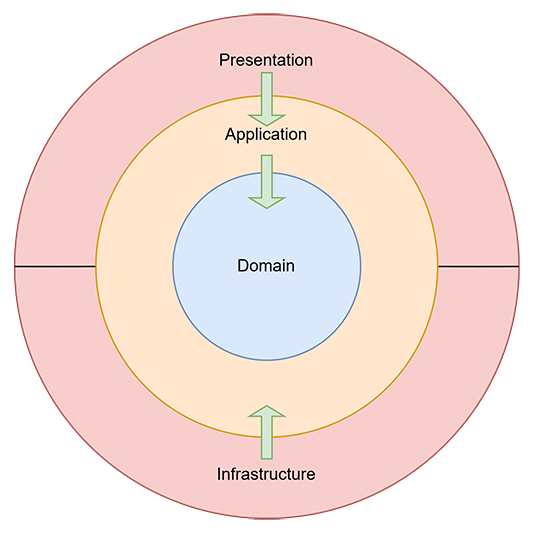
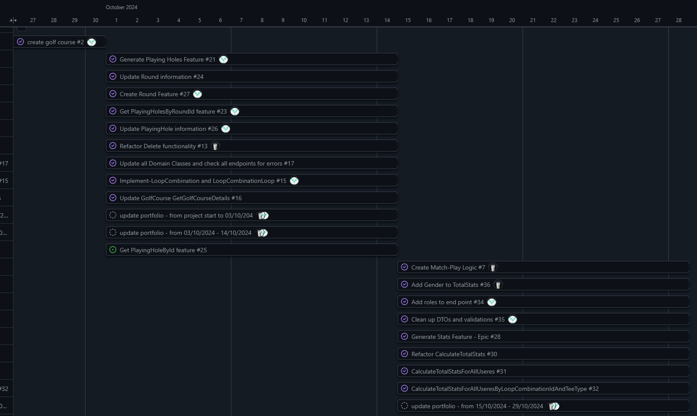

### **Introduktion**
 Denne portefølje er en samling af mit arbejde og mine refleksioner fra mit 4. semester, hvor jeg har valgt at specialisere mig i Backend-udvikling og Blazor.

Gennem mit projekt for Odense Golfklub har jeg haft mulighed for at kombinere teori og praksis ved at udvikle en løsning, der effektivt håndterer golfspilleres data og præstationer. Mit mål var at automatisere manuelle opgaver, som statistikberegninger, for at give trænerne bedre indsigt i spillernes præstationer og frigøre tid til andre opgaver.

Ved at anvende teknologier som Clean Architecture, CQRS og JWT i backend og Blazor i frontend har jeg skabt en dynamisk og brugervenlig applikation. Projektet har udfordret mig både teknisk og personligt, og jeg ser det som en vigtig milepæl i min udvikling som softwareudvikler.

---

### Min Specialisering  
Jeg har valgt at specialisere mig inden for backend-udvikling og Blazor-webapplikationer. Jeg arbejder på et projekt for Odense Golfklub, hvor fokus er at udvikle en løsning, der giver golftræneren bedre indsigt i sine spillere og deres præstationer. Projektet automatiserer manuelle opgaver som statistikanalyser, hvilket sparer tid og øger effektiviteten. Gennem projektet har jeg arbejdet med principper som Clean Architecture og CQRS i backend, samtidig med at jeg har skabt en dynamisk og brugervenlig frontend i Blazor, der integrerer med en sikker backend via API'er. I frontend har jeg især arbejdet med interaktive funktioner som søgning, sortering og farvekodning af data for at skabe en mere visuel og brugervenlig oplevelse.

---

### **Læringsmål for Backend**

#### **Viden**
- Forståelse af Clean Architecture og dets anvendelse til at opdele ansvar i lag som Domain, Application, Infrastructure og Presentation (API).
- Kendskab til CQRS-pattern for adskillelse af forespørgsler og kommandoer i backend.
- Forståelse af brugen af JWT-tokens til sikker API-kommunikation.
- Indsigt i datavalidering ved hjælp af FluentValidation.

#### **Færdigheder**
- Udvikle en backend baseret på Clean Architecture for at sikre skalerbarhed og vedligeholdelse.
- Implementere CQRS-pattern for bedre struktur og modularitet i backend.
- Bygge sikre API'er ved hjælp af JWT-tokens til autentifikation og autorisation.
- Sikre datakvalitet med datavalidering via FluentValidation.

#### **Kompetencer**
- Kunne selvstændigt designe og implementere en backend-struktur baseret på moderne designmønstre.
- Kritisk evaluere sikkerhedsmekanismer og datavalidering i forhold til projektets behov.
- Relatere backend-udvikling til bredere IT-udfordringer og samarbejde effektivt med frontend-udvikling.

---

### **Læringsmål for Blazor**

#### **Viden**
- Forståelse af komponentbaseret udvikling i Blazor WebAssembly.
- Kendskab til integration mellem frontend og backend via API-kald.
- Indsigt i håndtering af JWT-tokens i frontend til autentifikation.
- Forståelse af dynamisk datavisualisering med teknikker som farvekodning og interaktive tabeller.

#### **Færdigheder**
- Udvikle interaktive Blazor-komponenter, der understøtter databinding og events.
- Implementere frontend-backend-kommunikation med sikker håndtering af JWT-tokens.
- Bygge funktioner som søgning, sortering og dynamisk datavisualisering.
- Håndtere fejl og undtagelser i API-kommunikation på en brugervenlig måde.

#### **Kompetencer**
- Kunne selvstændigt designe og implementere en brugervenlig frontend med avancerede funktioner.
- Arbejde iterativt og forbedre UI baseret på feedback fra brugere og PO.
- Relatere frontend-udvikling til brugeroplevelse og backend-integration.

---

### **Arkitektur og Teknologi**

#### **Clean Architecture**
For at sikre en skalerbar og vedligeholdelsesvenlig løsning har jeg anvendt Clean Architecture som grundlag for backend-strukturen. Denne tilgang adskiller ansvarsområder i fire lag:
- **Domain**: Indeholder kerneentiteter og deres relationer.
- **Application**: Håndterer use cases og validering.
- **Infrastructure**: Sikrer dataadgang og integration.
- **API**: Eksponerer funktionalitet til frontend.

Diagrammet nedenfor illustrerer, hvordan lagene interagerer, og hvordan afhængigheder kun peger indad for at sikre løs kobling:



Ved at bruge denne struktur kunne jeg nemt tilføje nye funktioner som statistikberegninger og dataindsamling uden at påvirke andre dele af systemet.

---

#### **CQRS og MediatR**
For at optimere systemets struktur og modularitet implementerede jeg CQRS (Command Query Responsibility Segregation sammen med MediatR. Dette mønster adskiller læse- og skriveoperationer og gør koden mere overskuelig og testbar.

Eksempel:
- **Kommando**: `CreateTeeCommandHandler` håndterer oprettelse af en ny tee med validering og datalagring.
- **Forespørgsel**: `GetTeeDetailRequestHandler` henter detaljerede oplysninger om en tee fra databasen.

Denne opdeling gav mulighed for at implementere ændringer og tilføjelser uden at påvirke eksisterende funktionalitet (Se logbogen for mere detaljeret dokumentation om CQRS-implementeringen).

---

### **JWT-tokens og sikkerhed**

For at sikre systemets API-endpoints har jeg anvendt JWT-tokens. Dette giver en robust sikkerhedsløsning, der beskytter data mod uautoriseret adgang. Ved hjælp af [Authorize]-attributten kunne jeg yderligere begrænse adgang til bestemte endpoints baseret på brugerroller, såsom “Admin” for oprettelse af nye golfklubber.

For at gøre test og udvikling mere effektiv integrerede jeg Swagger, som understøtter autentifikation med JWT-tokens direkte i dokumentationen. Dette gjorde det muligt for udviklere at teste API’et hurtigt og sikkert.

---

### **Statistikberegninger og Visualisering**

En central del af projektet var udviklingen af statistikfunktioner, der hjælper trænere med at analysere spillerpræstationer. Systemet beregner avancerede statistikker som:
- **Fairway Hits %**: Procentdelen af fairways, spilleren ramte.
- **Green in Regulation %**: Hvor ofte spilleren nåede greenen inden for "Par - 2".
- **Hulspil Score**: En vigtig funktion i systemet er beregningen af spillerens Hulspil Score, der repræsenterer gennemsnittet af slag pr. hul i en given runde. For at give en fair vurdering justeres scorer, der er værre end double bogey, automatisk til double bogey, før de indgår i beregningen. Dette sikrer, at ekstremsituationer ikke påvirker gennemsnittet uforholdsmæssigt meget (Krav tilføjet af PO under udviklingen af systemet).

Eksempel på beregning:
```csharp
        public double CalculateAvgMatchPlayScorePerRound(List<PlayingHoleDto> playingHoles)
        {
            // Group playing holes by roundId
            var roundScores = playingHoles.GroupBy(ph => ph.RoundId)
                .Select(g =>
                {
                    double totalAdjustedScore = 0.0;

                    foreach (var ph in g)
                    {
                        // calculate the adjusted score
                        double adjustedScore = ph.Score > (ph.Par + 2) ? (ph.Par + 2) : ph.Score;
                        totalAdjustedScore += adjustedScore;
                    }

                    return totalAdjustedScore;
                })
                .ToList();

            // Calculate the avg adjusted score = MatcPlayScoreAvg.
            return roundScores.Any() ? roundScores.Average() : 0.0;
        }
```

Disse beregninger præsenteres visuelt som grafer og farvekodede tabeller, der gør det nemt for trænere at identificere forbedringsområder for deres spillere.


---

### **Refleksioner**

#### **Planlægning og mål**
Selvom jeg ikke havde en fastlagt skemastruktur, arbejdede jeg med klare mål og en overordnet plan, som blev visualiseret ved hjælp af et Gantt-diagram. Diagrammet hjalp mig med at organisere mit arbejde og sikre, at jeg holdt fokus på projektets vigtigste leverancer. Planen omfattede faser som:
- **Analyse og design**: Systemanalyse, kravspecifikation og design af systemarkitektur.
- **Backend-udvikling**: Implementering af kernefunktioner, autorisation og statistikberegninger.
- **Frontend-udvikling**: Udvikling af UI-komponenter og integration med backend.
- **Feedback og iterationer**: Justering af løsninger baseret på feedback fra Product Owner.



Ved at arbejde med planen kunne jeg nemt opdele komplekse opgaver i mindre trin og prioritere dem baseret på deres betydning for projektets læringsmål.

#### **Arbejde uden fast struktur**
På trods af den overordnede plan arbejdede jeg uden en fast daglig struktur, hvilket gav mig frihed til at udforske og lære i mit eget tempo. Dette var både en styrke og en udfordring. På den ene side kunne jeg fokusere på de områder, der krævede mest opmærksomhed, men på den anden side savnede jeg nogle gange en fast rytme til at holde mig fuldt organiseret. Hvis jeg havde arbejdet med en strammere tidsplan, kunne jeg måske have udnyttet tiden endnu mere effektivt.

#### **Feedback og kommunikation**
Samarbejdet med Product Owner var en vigtig del af projektet, og feedbacken fra ham gav os flere nyttige indsigter. Under en præsentation viste vi vores API-endpoints ved hjælp af Swagger for at demonstrere systemets tekniske funktionalitet. PO nævnte dog, at han ikke fik så meget ud af denne tilgang. Han ville have haft mere gavn af en simpel visuel præsentation, såsom et diagram eller en tegning, der kunne forklare systemets funktioner på et overordnet niveau.

Denne oplevelse mindede mig om vigtigheden af at tilpasse kommunikationen til målgruppen. Ikke alle interessenter har behov for dyb teknisk indsigt, og fremover vil jeg fokusere mere på at bruge visuelle værktøjer og diagrammer til at formidle komplekse løsninger på en mere tilgængelig måde. Dette vil sikre, at interessenter forstår værdien af løsningen og dens anvendelse.

#### **Opnåelse af læringsmål**
Jeg har opnået betydelige fremskridt i forhold til mine læringsmål, især inden for backend-udvikling og systemarkitektur:
- **Clean Architecture** gav mig værdifuld erfaring i at skabe en fleksibel og vedligeholdelsesvenlig kodebase. Jeg lærte at opdele applikationen i lag, hvilket gjorde det lettere at implementere nye funktioner og rette fejl.
- **CQRS og Repository Pattern** hjalp mig med at skabe en skalerbar og modular backend. Jeg har lært at strukturere koden med tydelig adskillelse af læse- og skriveoperationer ved hjælp af MediatR, hvilket har gjort min kodebase mere testbar og vedligeholdelsesvenlig.
- **Autorisering og sikkerhed** via JWT-tokens gav mig dybere indsigt i moderne sikkerhedsmekanismer. Jeg forstod, hvordan man implementerer sikker kommunikation og begrænser adgang til API-endpoints baseret på brugerroller.

#### **Personlig udvikling**
Dette semester har været en vigtig læringsrejse. Jeg har ikke kun styrket mine tekniske færdigheder, men også udviklet en dybere forståelse af, hvordan man opbygger systemer, der både er robuste og brugervenlige. Arbejdet med komplekse designmønstre og teknologier har forbedret min evne til at analysere problemer og finde effektive løsninger.

#### **Forbedringsområder**
- **Strammere tidsstyring**: Selvom planen fungerede godt som en guide, kunne jeg have brugt den mere aktivt til at evaluere mit daglige arbejde og sikre, at jeg holdt mig på rette spor.
- **Tilpasning af kommunikation**: Denne erfaring med PO viste mig, at kommunikation skal målrettes mod modtagerens behov. Jeg vil fremover bruge flere visuelle værktøjer og forberede alternative måder at præsentere teknisk komplekse emner.
- **Udvidelse af frontend-kompetencer**: Mit fokus har været på backend, men der er stadig områder i frontend-udviklingen, hvor jeg kan forbedre mine færdigheder, især inden for brugeroplevelse og design.

#### **Konklusion**
Min erfaring med dette projekt har været utrolig lærerig. Jeg har fået praktisk erfaring med at anvende komplekse designprincipper som Clean Architecture og CQRS samt teknologier som JWT. Samtidig har jeg lært vigtigheden af planlægning og struktur for at kunne arbejde effektivt. Denne proces har også lært mig at tilpasse min kommunikation til målgruppen, hvilket jeg ser som en uvurderlig færdighed fremover. Dette semester har ikke kun styrket mine tekniske kompetencer, men også min evne til at reflektere over mit arbejde og finde måder at forbedre det på.

---
